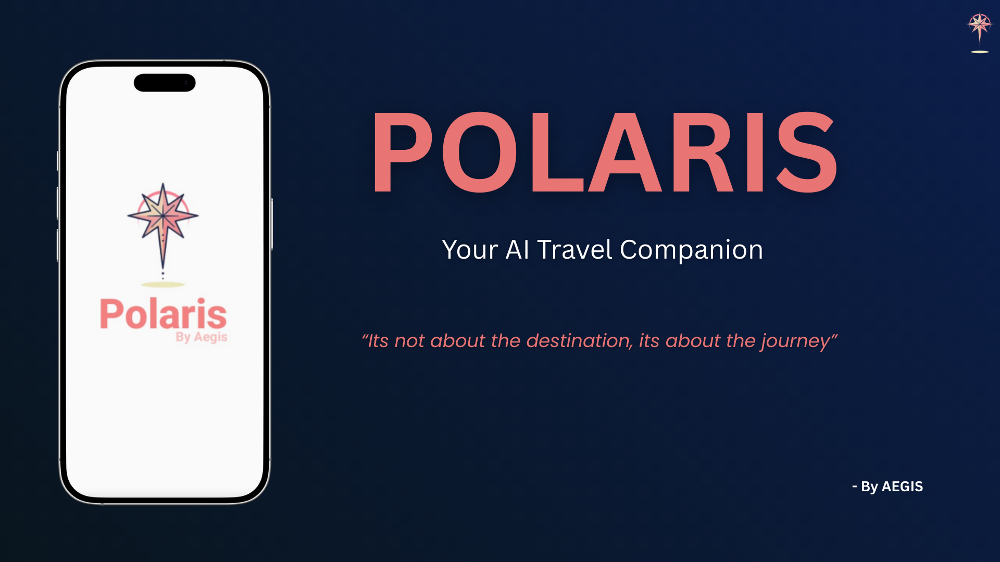
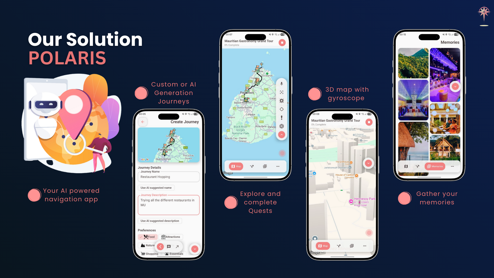

# Polaris - Your AI Travel Companion 🧭

<div align="center">
  
  
  **🏆 1st Place Winner - UoM AppCup 2025**
  
  *"It's not about the destination, it's about the journey."*
  
  [](https://www.android.com)
  [](https://kotlinlang.org)
  [](LICENSE.md)
</div>

## 📖 Overview

**Polaris** is an innovative AI-powered navigation application that transforms the way people explore the world. Unlike traditional navigation apps that are sterile and transactional, Polaris brings adventure, accessibility, and delight back into exploration. Born from the vision that navigation should be more than just directions, Polaris combines cutting-edge AI technology with gamification and accessibility features to create a truly inclusive travel companion.



## ✨ Features

### 🗺️ Core Navigation
- **AI-Powered Journeys** - Create custom routes or let AI generate unique adventures tailored to your preferences
- **3D Gyroscope Map** - Experience immersive navigation with auto-orientation for better spatial awareness
- **Smart Route Planning** - Intelligent path optimization based on your interests and time constraints

### 🎮 Gamification
- **Quest Mode** - Transform exploration into an adventure with challenges and rewards (inspired by Pokémon Go)
- **Achievement System** - Unlock badges and rewards as you explore new places
- **Leaderboards** - Compete with friends and the community

### 🤖 AI Capabilities
- **AI Camera** - Real-time descriptions of surroundings and landmarks using computer vision
- **Gemini Live Integration** - Conversational AI assistant for natural interaction
- **Smart Recommendations** - Personalized suggestions based on your exploration history

### 💾 Personal Features
- **Memory Keeper** - Save, revisit, and share meaningful places with rich metadata
- **Journey History** - Track and relive your adventures
- **Social Sharing** - Share your discoveries with friends and family

### ♿ Accessibility & Inclusivity
- **Voice Control** - Complete hands-free navigation with voice commands
- **Multilingual Assistant** - Support for global explorers in multiple languages
- **Live Translate** - Real-time translation between English and French
- **Scene Descriptions** - AI-powered descriptions for low-vision users
- **Auto-Orienting Maps** - Enhanced spatial awareness for all users

## 👥 Team Aegis Contributors

* **Atish Joottun**
* **Poshan Peeroo**
* **Ritesh Sharma Gomind**
* **Kevin Yerkiah**
* **Bhovanen Murday**

## 🛠️ Tech Stack

### Mobile Development
- **Kotlin** - Primary programming language
- **Jetpack Compose** - Modern UI framework with Material 3 design
- **Clean Architecture** - Scalable and maintainable project structure

### Backend & Services
- **Supabase** - Database management and authentication
- **Gemini Live API** - Conversational AI and natural language processing
- **Google Maps SDK** - Core mapping and navigation functionality

### Libraries & Tools
- **Navigation 3** - Type-safe navigation between screens
- **Ktor** - Efficient network requests and API communication
- **Koin** - Dependency injection for modular architecture
- **Sensor Data API** - Gyroscope integration for 3D map functionality

## 📋 Prerequisites

Before building and running Polaris, ensure you have the following installed:

- **Android Studio** (Narwhal or later) - [Download](https://developer.android.com/studio)

### API Keys Required
- **Google Maps API Key** - [Get it here](https://developers.google.com/maps/documentation/android-sdk/get-api-key)
- **Supabase Project** - [Create account](https://supabase.com/)
- **Gemini API Key** - [Get access](https://ai.google.dev/)

## 🚀 Installation & Setup

### 1. Clone the Repository

```bash
git clone https://github.com/TeamAegis/Polaris.git
cd Polaris
```

### 2. Configure Environment Variables

Create a `local.properties` file in the project root with your API keys:

```properties
# API Keys
SUPABASE_URL="your_supabase_project_url"
SUPABASE_API_KEY="your_supabase_anon_key"
GEMINI_LIVE_API_KEY="your_gemini_api_key"
MAPS_API_KEY=your_google_maps_api_key
MAPS_APP_API_KEY="your_google_maps_api_key"
```

### 3. Configure Supabase

Set up your Supabase project with the required tables:

```sql
CREATE TABLE public.fragments (
  id uuid NOT NULL DEFAULT gen_random_uuid(),
  public_waypoint_id uuid NOT NULL,
  user_id uuid NOT NULL DEFAULT auth.uid(),
  fragment_url text DEFAULT 'NULL'::text,
  created_at timestamp with time zone NOT NULL DEFAULT now(),
  message text DEFAULT 'NULL'::text,
  CONSTRAINT fragments_pkey PRIMARY KEY (id),
  CONSTRAINT fragments_user_id_fkey FOREIGN KEY (user_id) REFERENCES auth.users(id),
  CONSTRAINT fragments_public_waypoint_id_fkey FOREIGN KEY (public_waypoint_id) REFERENCES public.public_waypoints(id)
);

CREATE TABLE public.journeys (
  id uuid NOT NULL DEFAULT gen_random_uuid(),
  name character varying NOT NULL,
  description text NOT NULL,
  preferences json NOT NULL,
  encoded_polyline text NOT NULL,
  status character varying NOT NULL,
  user_id uuid NOT NULL DEFAULT auth.uid(),
  created_at timestamp with time zone NOT NULL DEFAULT now(),
  CONSTRAINT journeys_pkey PRIMARY KEY (id),
  CONSTRAINT journeys_user_id_fkey FOREIGN KEY (user_id) REFERENCES auth.users(id)
);

CREATE TABLE public.memories (
  id uuid NOT NULL DEFAULT gen_random_uuid(),
  personal_waypoint_id uuid NOT NULL,
  journey_id uuid NOT NULL,
  user_id uuid NOT NULL DEFAULT auth.uid(),
  memory_url text NOT NULL,
  created_at timestamp with time zone NOT NULL DEFAULT now(),
  CONSTRAINT memories_pkey PRIMARY KEY (id),
  CONSTRAINT memories_journey_id_fkey FOREIGN KEY (journey_id) REFERENCES public.journeys(id),
  CONSTRAINT memories_user_id_fkey FOREIGN KEY (user_id) REFERENCES auth.users(id),
  CONSTRAINT memories_personal_waypoint_id_fkey FOREIGN KEY (personal_waypoint_id) REFERENCES public.personal_waypoints(id)
);

CREATE TABLE public.messages (
  id uuid NOT NULL DEFAULT gen_random_uuid(),
  role character varying NOT NULL DEFAULT ''::character varying,
  content text NOT NULL DEFAULT ''::text,
  timestamp timestamp with time zone NOT NULL DEFAULT now(),
  user_id uuid NOT NULL DEFAULT auth.uid(),
  CONSTRAINT messages_pkey PRIMARY KEY (id),
  CONSTRAINT messages_userId_fkey FOREIGN KEY (user_id) REFERENCES auth.users(id)
);

CREATE TABLE public.personal_waypoints (
  id uuid NOT NULL DEFAULT gen_random_uuid(),
  place_id text,
  name character varying,
  address character varying,
  latitude double precision NOT NULL,
  longitude double precision NOT NULL,
  is_unlocked boolean NOT NULL DEFAULT false,
  type character varying NOT NULL,
  user_id uuid NOT NULL DEFAULT auth.uid(),
  journey_id uuid NOT NULL,
  CONSTRAINT personal_waypoints_pkey PRIMARY KEY (id),
  CONSTRAINT personal_waypoint_user_id_fkey FOREIGN KEY (user_id) REFERENCES auth.users(id),
  CONSTRAINT personal_waypoints_journey_id_fkey FOREIGN KEY (journey_id) REFERENCES public.journeys(id)
);

CREATE TABLE public.public_waypoints (
  id uuid NOT NULL DEFAULT gen_random_uuid(),
  address character varying,
  longitude double precision NOT NULL,
  latitude double precision NOT NULL,
  CONSTRAINT public_waypoints_pkey PRIMARY KEY (id)
);
```

### 4. Build the Project

Open the project in Android Studio and sync Gradle:

```bash
# Or build from command line
./gradlew build
```

### 5. Run the Application

#### Using Android Studio
1. Select a device/emulator from the device dropdown
2. Click the "Run" button or press `Shift + F10`

## 📄 License

This project is licensed under a Proprietary License.
All rights reserved. See the [LICENSE](LICENSE.md)

## 🏆 Recognition

Polaris was crowned 1st Place Winner 🥇 at the UoM AppCup 2025, hosted by the University of Mauritius Computer Club. The project stood out for its innovation, inclusivity, and creativity in redefining digital navigation.

## 🙏 Acknowledgments

- **UoM Computer Club** - For organizing AppCup 2025
- **University of Mauritius** - For providing the platform

---

<div align="center">
  Made with ❤️ by Team Aegis
  
  **Polaris - Making navigation personal, inclusive, and fun.**
</div>